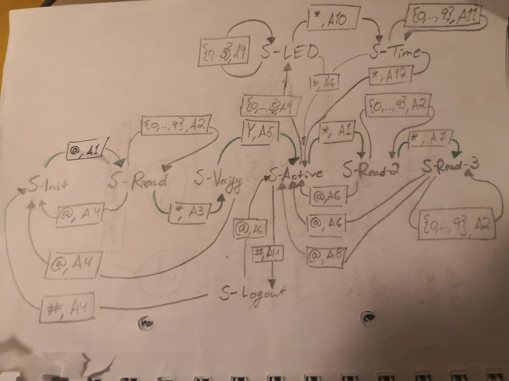

# Project 5 Keypad - FINISHED

Operate the Keypad by typing into console. Only the symbols 0-9, as well as '#' and '*' are considered.

Password is 12345.

The FSM acts mostly according to this graph. Actions are not labeled and not always accurate:

